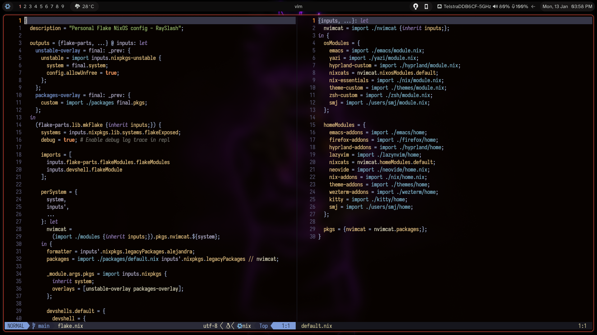
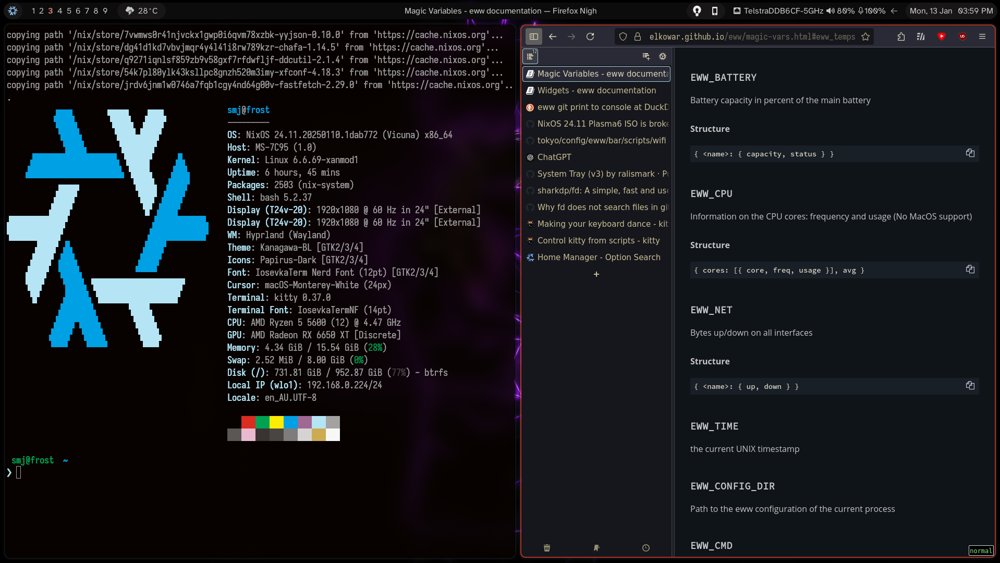

# 🖥️ NixOS & Home-Manager Dotfiles


My personal NixOS configuration featuring multiple hosts and modern development setups.

> **NOTE**: These configs are highly opinionated - use as inspiration, not copy-paste!

## 🚀 Usage

### ✏️ Emacs Configuration

```bash
nix run github:rayslash/dotfiles#emacats
```

### 🧩 Neovim Configuration

```bash
nix run github:rayslash/dotfiles#nvimcat
# OR use following for a minimal config
nix run github:rayslash/dotfiles#nvim-minimal
```

### 📀 Live ISO Generation

Build bootable NixOS ISO with `live` nixos host configuration:

```bash
nix build .#images.x86_64
nix build .#images.rpi-sd
```

### 🛠️ System Installation

**Fresh Install Procedure:**

> **⚠️ Important**: Replace `MYHOST` and all `INSTALL_*` variables with
> desired values before running. By default, following instructions
> assume you are install the `frost` host configuration in a 3 volume partitioned nvme drive.

```bash
nix-shell -p git neovim
export INSTALL_DEVICE_NAME="nvme0n1"
export INSTALL_EFI_LABEL="nvme0n1p1"
export INSTALL_ROOT_LABEL="nvme0n1p2"
export INSTALL_NIX_LABEL="nvme0n1p3"
export INSTALL_DEVICE="/dev/$INSTALL_DEVICE_NAME"
sudo fdisk $INSTALL_DEVICE_NAME  # Create required partitions
sudo mkfs.fat -F 32 /dev/$INSTALL_EFI_LABEL # Format an EFI partition
sudo mkfs.ext4 /dev/$INSTALL_ROOT_LABEL # Format Linux filesystem partition (ext4, btrfs ...)
sudo mount /dev/$INSTALL_ROOT_LABEL /mnt  # Mount root partition
sudo mount /dev/$INSTALL_EFI_LABEL /mnt/boot  # Mount boot
sudo mount /dev/$INSTALL_NIX_LABEL /mnt/nix  # Mount nix (optional)

export DOTFILES="/mnt/etc/dotfiles"
export MYHOST="frost"
export HOSTCONFIG_DIR="$DOTFILES/system/hosts/$MYHOST"
git clone https://github.com/RaySlash/dotfiles $DOTFILES
mv "$HOSTCONFIG_DIR/hardware-configuration.nix" "$HOSTCONFIG_DIR/hardware-configuration-old.nix"
sudo nixos-generate-config --root /mnt
sudo cp /mnt/etc/nixos/hardware-configuration.nix $HOSTCONFIG_DIR
nvim "$HOSTCONFIG_DIR/hardware-configuration.nix"

sudo nixos-install --flake .#$MYHOST
```

## 🧠 Philosophy

### Core Principles:

- 🔌 **Explicit Wiring**:
  - Configurations are directly referenced via absolute paths
  - No implicit file tree crawling

- 📚 **Layered Composition**: Modules set defaults that can be cleanly overridden:

  ```nix
  # modules/kitty/default.nix
  { lib, ... }: {
    programs.kitty = {
      enable = lib.mkForce true;
      defaultTerminal = lib.mkDefault true; # Default that can be disabled
    };
  }

  # hosts/myhost/default.nix
  { lib, ... }: {
    programs.kitty = {
      # Explicit override of default
      defaultTerminal = false;
    };
  }
  ```

- 🧰 **Utility-First**:
  - Abstract common patterns into repo-specific functions:

  ```nix
  # utils/lib.nix
  { inputs }: let
    # ....
  in
  {
  inherit
    mkPkgs
    mkHome
    mkSystem
    ;
  }
  ```

- 🚫 **Anti-Pattern Rejection**:
  - No automatic inclusion of `./hosts/*.nix`
  - No magic "profiles" directory
  - No recursive config discovery

> "Configs should be obvious, not clever"
> i.e., Direct file references > Convention over configuration

## 🔗 Resources

- 🧩 **[Starter Config](https://github.com/Misterio77/nix-starter-configs)** - Flake template foundation
- 📦 **[Nixpkgs](https://github.com/NixOS/nixpkgs)** - Official package repository
- 📚 **[NixOS Wiki](https://nixos.wiki/)** - Community-maintained knowledge base
- 🖥️ **[Hyprland Wiki](https://wiki.hyprland.org/)** - Window manager documentation

## 🖼️ Screenshots

  

